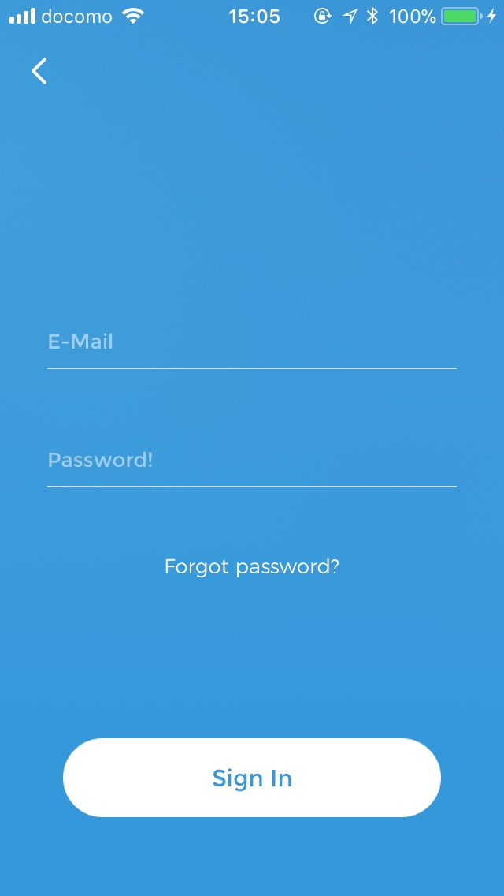

# LoginHelper
[](http://cocoapods.org/pods/NotificationBannerSwift)


### About:
A login library specially made for products of Trim, a quick and easy way to add facebook, google, babymap, email login/signup to an application.
This library not only help you handle login/signup logic but also take care UI, validation, facebook/google SDK access


| First View | Sign in View  | new account View | Recovery View |
| ------------- | ------------- | ------------- | ------------- |
|   |   |  |  |

### Installation:
#### • CocoaPods
LoginHelper is available through CocoaPods. To install it, simply add the following line to your Podfile:
```
pod "LoginHelper"
```
### Getting Started:

```
import LoginHelper
class LoginCoordinator: ILLoginKit.LoginCoordinator {
 override func login(email: String, password: String) {
        // Handle login via your API
    }

    override func signup(name: String, email: String, password: String) {
        // Handle signup via your API
    }

    override func enterWithFacebook(profile: FacebookProfile) {
        // Handle login via your API
    }
    override func enterWithGoogle() {
        // Handle login via your API
        print("enterWithGoogle")
    }
    override func enterWithBabyMap() {
        // Handle login via your API
        // Open babymap login View
         print("enterWithBabyMap")
    }

    override func recoverPassword(email: String) {
       //Send recovery code to email
    }
    override func checkRecoveryCodeAndLogin(email: String, password: String, recoveryCode: String) {
       //check recovery code to login
    }
}
```

Then in your controller:

```
import LoginHelper

class ViewController: UIViewController { 

    lazy var loginCoordinator: LoginCoordinator = {
        return LoginCoordinator(rootViewController: self)
    }()
    
    ...

    func showLogin() {
        loginCoordinator.start()
    }
    
    ...

}
```
